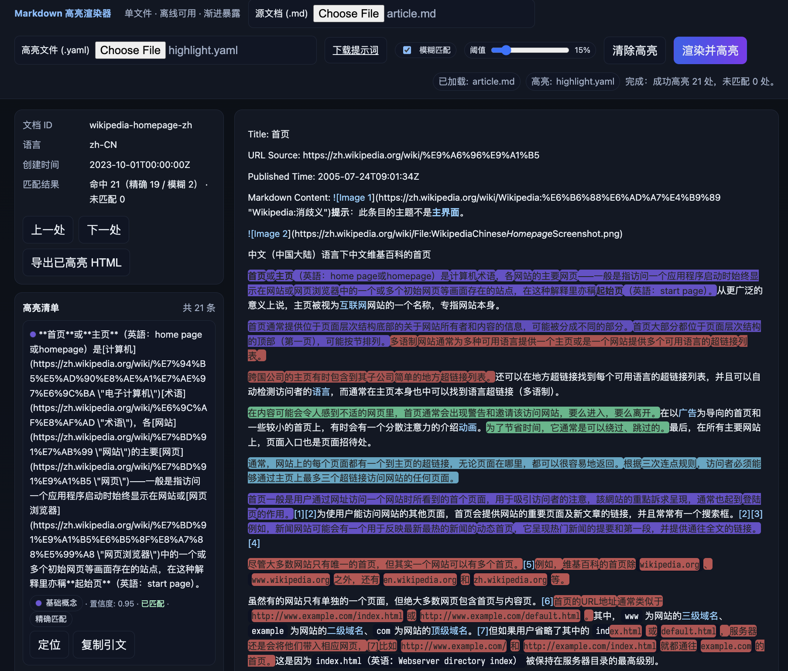

# Markdown 高亮渲染器 · 单文件 SPA

一个纯前端、可离线使用的 Markdown 渲染与高亮工具：
- 加载本地 Markdown 源文件（.md）并渲染成文档
- 加载本地高亮规则（.yaml），在文档中定位并高亮对应句子
- 支持“精确匹配 + 模糊匹配（可调阈值）”两种定位模式
- 侧栏展示高亮清单、类型/置信度、定位与复制操作
- 一键导出“已高亮”的 HTML 页面

> 无需安装依赖、无需打包构建，直接用浏览器打开 `index.html` 即可使用。

---



---

## Live

- GitHub Pages: https://meomeo-dev.github.io/html_highlight_rendering/

---

## 目录结构

- `index.html`：应用本体（单文件、包含样式与脚本）
- `article.md`：示例中文 Markdown 文档
- `article_en.md`：示例英文 Markdown 文档
- `highlight.yaml`：示例中文高亮结果（与 `article.md` 配套）
- `highlight_en.yaml`：示例英文高亮结果（与 `article_en.md` 配套）
- `highlight.prompt.md`：用于生产高亮 YAML 的提示词与输出规范

---

## 快速开始（离线）

1) 双击打开 `index.html`（或在浏览器中通过“文件 > 打开文件…”打开）
2) 在页面左上角：
   - 选择“源文档 (.md)”：加载你的 Markdown 文件
   - 选择“高亮文件 (.yaml)”：加载你的高亮结果 YAML
3) 可选：勾选“模糊匹配”，并调节“阈值”滑块（默认 15%）
4) 点击“渲染并高亮”
5) 使用侧栏按钮“上一处/下一处”在高亮之间跳转
6) 点击“导出已高亮 HTML”，保存当前带有高亮标记的页面

提示：页面顶部会显示当前加载的文件名与处理状态，侧栏“高亮清单”展示所有 quote 的匹配情况、类型、置信度与一键定位/复制。

---

## YAML 结构（简述）

YAML 的完整说明见 `highlight.prompt.md` 的 `final_output_spec`。常见字段：

- `schema_version` (string，可选)：语义化版本号
- `document_id` (string，可选)：文档唯一标识
- `language` (string，可选)：BCP 47 语言代码（如 `zh-CN`、`en`）
- `created_at` (ISO8601，可选)：生成时间
- `results` (array，必需)：逐段的“关键句子”提取结果；应用会从这些结果中读取 quotes 并在文档里定位高亮

每个 `results` 项形如：

```yaml
- result:
    rationale: "为什么这句话重要的简述（可选）"
    type: "基础概念 | 关键术语 | 举例 | 步骤/流程 | …"
    quotes:
      - "需要在文档中高亮的句子 A（保持原文大小写与标点）"
      - "需要在文档中高亮的句子 B"
    confidence: 0.95
    gap: "影响置信度的信息缺口（可为空字符串）"
```

> 也支持 `quote: "..."`（单值）或内联数组 `quotes: ["...", "..."]`，应用会自动“压平”为多条高亮项。

---

## 匹配与高亮说明

- 精确匹配：先对全文与引文做规范化（空白合并、弯引号→直引号），再进行子串定位
- 模糊匹配：
  - 对未命中的条目尝试“桥接间隙”匹配（适配引用标注如 `[7]` 等插入）
  - 再按“编辑距离”风格的近似定位，阈值可在 UI 中调节
- 高亮颜色：按 `type` 做稳定的色盘映射（同类同色），并根据 `confidence` 调整透明度

---

## 已知限制

- 解析器为轻量实现，覆盖常见 Markdown 语法（标题/段落/列表/引用/行内样式/代码块等）；极端 Markdown 特性可能无法完全一致
- 超长文档或大量 quotes 启用“模糊匹配”时，性能可能下降
- 为避免干扰，脚本/样式节点不会被纳入搜索范围

---

## 开发与构建

- 本项目无构建流程与依赖：仅一个 `index.html`
- 建议在 Chrome / Edge / Safari 最新版测试
- 如需扩展：可将脚本拆分为模块化文件、引入测试用例与性能基准，或接入更完善的 Markdown/YAML 解析库

---

## 许可证

本项目采用 MIT 许可证发布。详见 `LICENSE` 文件。

第三方库的许可证与合规说明见：[`THIRD_PARTY_NOTICES.md`](./THIRD_PARTY_NOTICES.md)。